# Deploy a Containerized Flask Backend on Amazon EKS

An end-to-end AWS + Kubernetes project that builds a managed **Amazon EKS** cluster, containerizes a **Python Flask backend** with Docker, stores the image in **Amazon ECR**, creates Kubernetes manifests, and deploys the application to EKS.

> **NextWork project series**
> - [Part 1 — Launch a Kubernetes Cluster](https://nextwork.ai/projects/aws-compute-eks1?track=high)
> - [Part 2 — Set Up Kubernetes Deployment](https://nextwork.ai/projects/aws-compute-eks2)
> - [Part 3 — Create Kubernetes Manifests](https://nextwork.ai/projects/aws-compute-eks3)
> - [Part 4 — Deploy Backend with Kubernetes](https://nextwork.ai/projects/aws-compute-eks4)
>
> This README combines my implementation notes, commands, results, and screenshots from all four stages into one end-to-end project.

## Final Architecture

[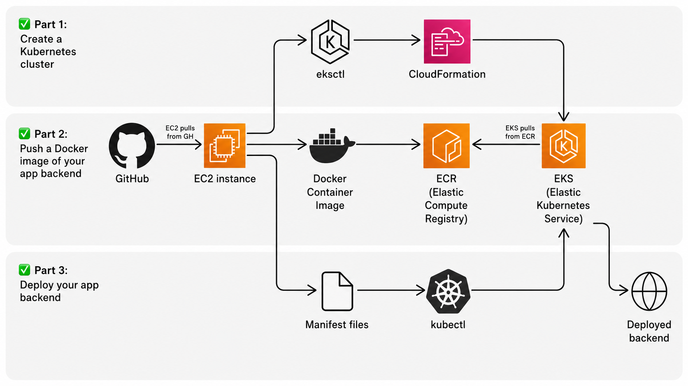](images/00-final-architecture.png)

The completed workflow is:

```text
GitHub
   │
   ▼
EC2 Management Instance
   │
   ├── eksctl ──> CloudFormation ──> Amazon EKS
   │
   ├── Docker build ──> Amazon ECR ──> EKS pulls container image
   │
   └── Kubernetes manifests ──> kubectl ──> Amazon EKS
                                          │
                                          ▼
                                   Deployed Flask Backend
```

## Project Overview

Across the complete project, I:

- Launched an Amazon Linux 2023 EC2 management instance.
- Installed and used `eksctl` to provision an Amazon EKS cluster.
- Created an EKS managed node group with three `t3.micro` worker nodes.
- Verified provisioning through AWS CloudFormation, EKS, and EC2.
- Cloned the Flask backend application from GitHub.
- Installed Docker and built the backend container image.
- Created a private Amazon ECR repository with image scanning enabled.
- Tagged and pushed the Flask image to ECR.
- Installed and configured `kubectl`.
- Created Kubernetes Deployment and Service manifests.
- Configured the Deployment for three backend replicas.
- Applied the manifests to the EKS cluster.
- Verified the worker nodes, pods, service, and pod startup events.

## Environment & Configuration

| Component | Configuration |
|---|---|
| AWS Region | `us-west-2` — Oregon |
| EC2 management instance | `eks-instance` |
| EC2 operating system | Amazon Linux 2023 |
| EC2 instance type | `t3.micro` |
| EKS cluster | `nextwork-eks-cluster` |
| Kubernetes version | `1.33` |
| Managed node group | `nextwork-nodegroup` |
| Worker nodes | 3 × `t3.micro` |
| Minimum / maximum nodes | `1` / `3` |
| Backend application | `nextwork-flask-backend` |
| Container registry | Amazon ECR |
| Container tag | `latest` |
| Application port | `8080` |
| Deployment replicas | `3` |
| Kubernetes Service | `NodePort` |

> **Screenshot quality:** The project screenshots were copied from the original files without resizing or recompression. Click any screenshot to open the full-resolution image.

---

# Part 1 — Launch a Kubernetes Cluster

This stage creates the AWS infrastructure used by the rest of the project: the EC2 management instance, EKS control plane, managed node group, worker nodes, and supporting CloudFormation resources.

## Step 1 — Launch the EC2 Management Instance

Open the **Amazon EC2** console and launch an instance that will be used to run the EKS administration commands.

For this project, I used:

- **Name:** `eks-instance`
- **AMI:** Amazon Linux 2023
- **Instance type:** `t3.micro`
- **Region:** `us-west-2`

After launching the instance, verify that its state is **Running** and that the EC2 status checks pass.

[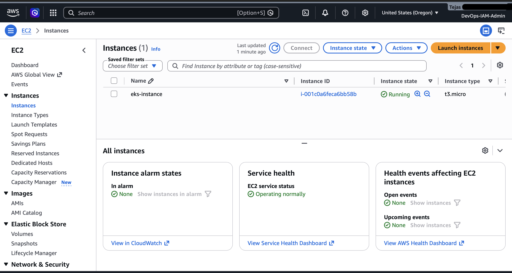](images/part1-01-ec2-instance-running.png)

---

## Step 2 — Connect to the EC2 Instance

Select the `eks-instance` instance in the EC2 console and choose **Connect**. I used **EC2 Instance Connect** to open a shell directly in the browser.

A successful connection should display the Amazon Linux 2023 shell and a prompt similar to:

```text
[ec2-user@ip-xxx-xxx-xxx-xxx ~]$
```

[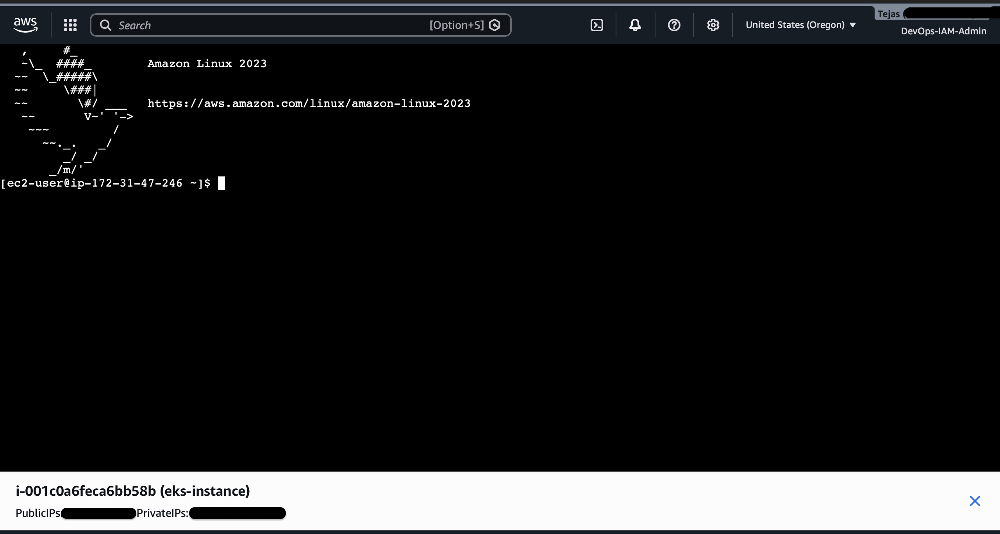](images/part1-02-connect-to-ec2.png)

---

## Step 3 — Give the EC2 Instance Permission to Provision EKS

`eksctl` creates resources across several AWS services, so the EC2 management instance needs an IAM role with sufficient permissions.

A learning-lab setup can be created from **IAM → Roles → Create role**:

1. Select **AWS service** as the trusted entity.
2. Select **EC2** as the use case.
3. Attach the permissions required to create EKS, EC2/VPC, IAM, Auto Scaling, and CloudFormation resources.
4. Attach the role to `eks-instance` from **EC2 → Actions → Security → Modify IAM role**.

> **Security note:** The referenced learning project may use broad administrator permissions to reduce setup friction. For production environments, use the **principle of least privilege** and grant only the permissions required for the provisioning workflow.

You can confirm which IAM identity the instance is currently using with:

```bash
aws sts get-caller-identity
```

---

## Step 4 — Install `eksctl`

`eksctl` is a command-line utility for creating and managing Amazon EKS clusters.

The commands used during this project were:

```bash
curl --silent --location \
  "https://github.com/weaveworks/eksctl/releases/latest/download/eksctl_$(uname -s)_amd64.tar.gz" \
  | tar xz -C /tmp

sudo mv -v /tmp/eksctl /usr/local/bin
```

Verify the installation:

```bash
eksctl version
```

During this run, the installed version was:

```text
0.229.0
```

[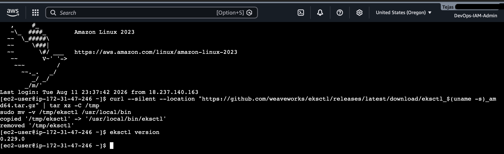](images/part1-03-eksctl-installed.png)

> The `eksctl` project is now maintained under the `eksctl-io` organization. For a fresh installation, check the current official installation instructions linked in the **References** section below.

---

## Step 5 — Create the Amazon EKS Cluster

Run the following command from the EC2 management instance:

```bash
eksctl create cluster \
  --name nextwork-eks-cluster \
  --nodegroup-name nextwork-nodegroup \
  --node-type t3.micro \
  --nodes 3 \
  --nodes-min 1 \
  --nodes-max 3 \
  --version 1.33 \
  --region us-west-2
```

### What the options mean

| Option | Purpose |
|---|---|
| `--name` | Names the EKS cluster. |
| `--nodegroup-name` | Names the managed EC2 worker-node group. |
| `--node-type` | Sets the EC2 instance type used by each worker node. |
| `--nodes 3` | Starts the node group with three worker nodes. |
| `--nodes-min 1` | Sets the minimum node-group size. |
| `--nodes-max 3` | Sets the maximum node-group size. |
| `--version 1.33` | Creates the cluster using Kubernetes 1.33. |
| `--region us-west-2` | Deploys the AWS resources to Oregon. |

At the beginning of the provisioning process, `eksctl` selected Availability Zones in `us-west-2`, created networking configuration, and began creating the EKS control plane and managed node group.

[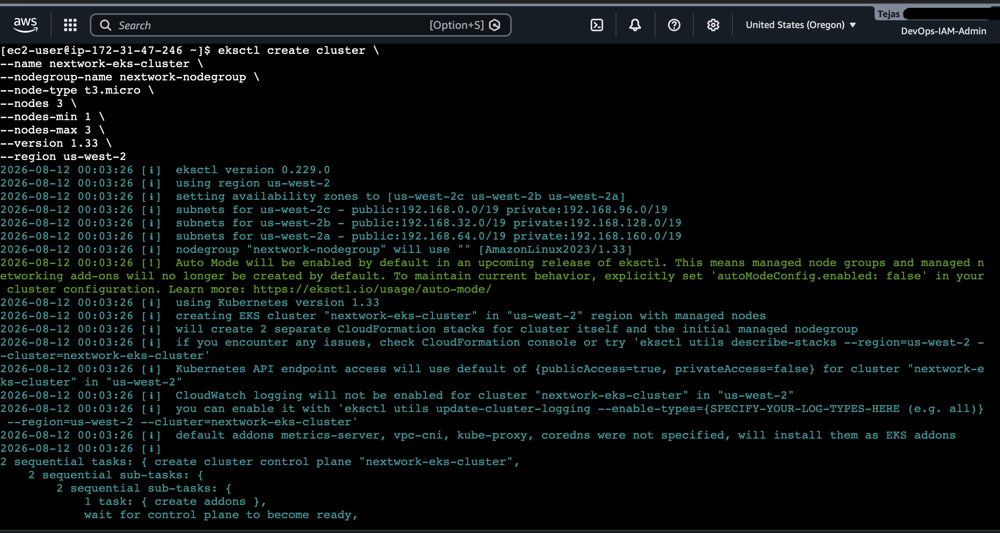](images/part1-04-launch-eks-cluster.png)

### Resources created by `eksctl`

For this run, `eksctl` automatically orchestrated resources including:

- EKS control plane
- VPC and subnets
- Security groups
- IAM roles
- Managed node group
- EC2 worker nodes
- Auto Scaling resources
- Core EKS add-ons such as VPC CNI, CoreDNS, and `kube-proxy`
- CloudFormation stacks used to provision and manage the infrastructure

Cluster creation can take several minutes because the control plane and worker infrastructure are provisioned before the nodes can join the cluster.

---

## Step 6 — Confirm Successful Cluster Creation

The terminal output confirmed that the EKS resources and managed node group were created successfully. It also showed all three worker nodes reaching a **Ready** state.

The important success message was:

```text
EKS cluster "nextwork-eks-cluster" in "us-west-2" region is ready
```

`eksctl` also saved the Kubernetes configuration to:

```text
/home/ec2-user/.kube/config
```

[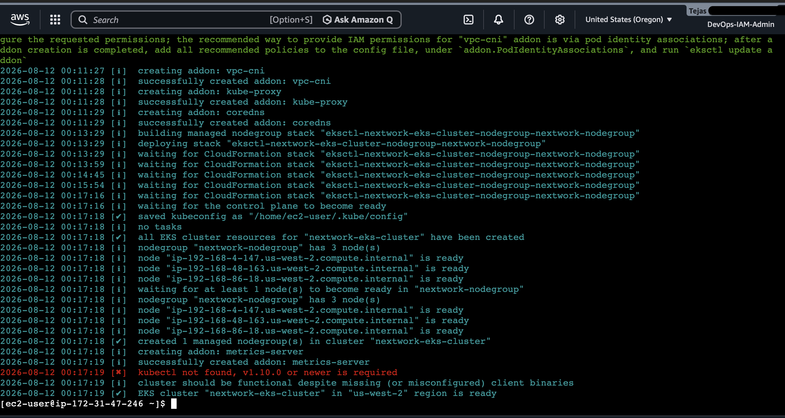](images/part1-05-eks-cluster-creation-succeeded.png)

### Note about the `kubectl not found` message

The screenshot also contains:

```text
kubectl not found, v1.10.0 or newer is required
```

This did **not** mean that the EKS cluster failed. The same output confirms that the cluster and all three nodes were successfully created. It only meant that the EC2 management instance did not yet have the `kubectl` client installed.

A compatible Kubernetes 1.33 client can be installed on Amazon Linux with:

```bash
curl -O https://s3.us-west-2.amazonaws.com/amazon-eks/1.33.10/2026-04-08/bin/linux/amd64/kubectl
chmod +x ./kubectl
mkdir -p $HOME/bin
cp ./kubectl $HOME/bin/kubectl
export PATH=$HOME/bin:$PATH
```

Verify the client:

```bash
kubectl version --client
```

Then verify the cluster nodes:

```bash
kubectl get nodes
```

---

## Step 7 — Track Provisioning with AWS CloudFormation

Open **AWS CloudFormation → Stacks** and filter for `eksctl`.

For this project, two primary stacks were created:

1. The EKS cluster stack
2. The managed node group stack

Both reached:

```text
CREATE_COMPLETE
```

[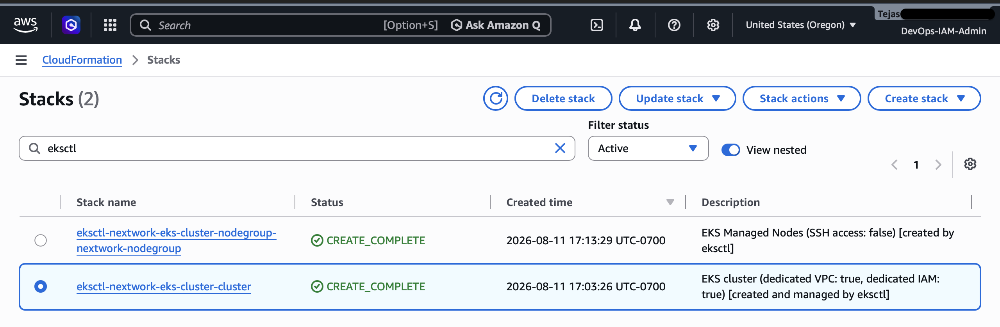](images/part1-06-cloudformation-stacks-complete.png)

This is useful because `eksctl` uses CloudFormation to declaratively provision and manage much of the underlying AWS infrastructure.

---

## Step 8 — Verify the Cluster in the Amazon EKS Console

Open **Amazon EKS → Clusters** in the same AWS Region used during creation (`us-west-2`).

The cluster should appear with:

- **Cluster:** `nextwork-eks-cluster`
- **Status:** `Active`
- **Kubernetes version:** `1.33`

[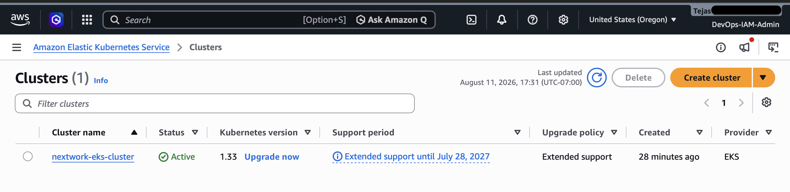](images/part1-07-eks-cluster-active.png)

---

## Step 9 — Verify the Managed Node Group and Worker Nodes

Open `nextwork-eks-cluster` and view its compute resources.

The project created one managed node group:

```text
nextwork-nodegroup
```

with a desired size of **3**. All three nodes were in the **Ready** state and used `t3.micro` instances.

[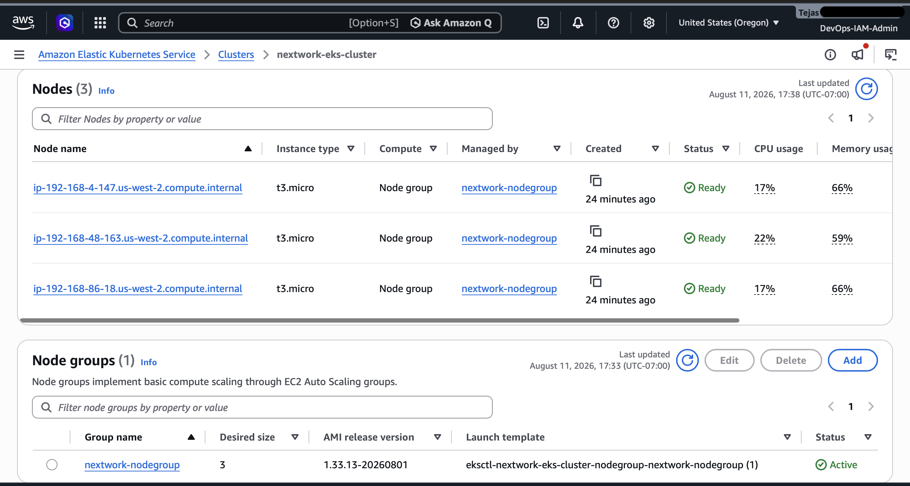](images/part1-08-nodes-and-nodegroup.png)

Conceptually:

```text
EKS Cluster
└── Managed Node Group: nextwork-nodegroup
    ├── EC2 Worker Node 1 (t3.micro)
    ├── EC2 Worker Node 2 (t3.micro)
    └── EC2 Worker Node 3 (t3.micro)
```

The **EKS control plane** is managed by AWS. The EC2 instances shown here are the **worker nodes** where Kubernetes workloads can run.

---

## Step 10 — Verify the EC2 Worker Instances

Return to **EC2 → Instances**.

In addition to the original `eks-instance` management machine, three new EC2 instances were created for the EKS managed node group.

That produced four visible instances in total during this project:

```text
1 EC2 management instance
+
3 EKS worker-node EC2 instances
=
4 EC2 instances
```

[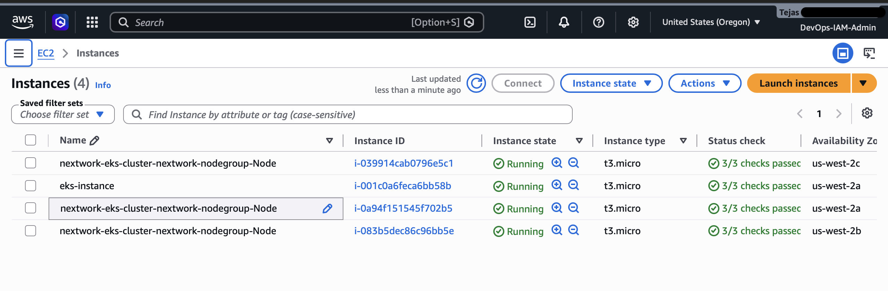](images/part1-09-ec2-worker-nodes.png)

The worker instances were distributed across multiple Availability Zones in `us-west-2`, which demonstrates how EKS can spread cluster compute across availability zones.

---

---

# Part 2 — Containerize the Backend and Push It to Amazon ECR

Part 2 reuses the EC2 and EKS environment from Part 1. The repeated cluster-creation steps are intentionally omitted here. This stage moves the Flask backend from source code in GitHub to a reusable Docker image stored in Amazon ECR.

## Step 1 — Install and Verify Git

Git is required to download the backend source code from GitHub.

On Amazon Linux 2023, install Git if it is not already available:

```bash
sudo dnf update -y
sudo dnf install git -y
```

Verify the installation:

```bash
git --version
```

Optionally configure the Git identity used on the EC2 instance:

```bash
git config --global user.name "YOUR_NAME"
git config --global user.email "YOUR_EMAIL"
```

> No project screenshot was captured for this installation step.

---

## Step 2 — Clone the Flask Backend Repository

Clone the backend application from GitHub:

```bash
git clone https://github.com/nextwork-projects/nextwork-flask-backend.git
```

The successful clone created a local directory named:

```text
nextwork-flask-backend
```

[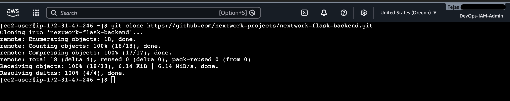](images/part2-01-clone-backend-repository.png)

---

## Step 3 — Inspect the Backend Files

List the current directory and move into the cloned application directory:

```bash
ls
cd nextwork-flask-backend
ls
```

The repository contains the files needed to build the application image:

```text
Dockerfile
README.md
app.py
requirements.txt
```

The `Dockerfile` defines how the backend is packaged into a container image, while `requirements.txt` contains the Python dependencies used by the Flask application.

[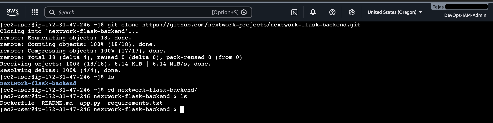](images/part2-02-verify-backend-files.png)

---

## Step 4 — Install Docker

Install Docker on the Amazon Linux EC2 management instance:

```bash
sudo yum install -y docker
```

This installs Docker and its required container runtime dependencies.

[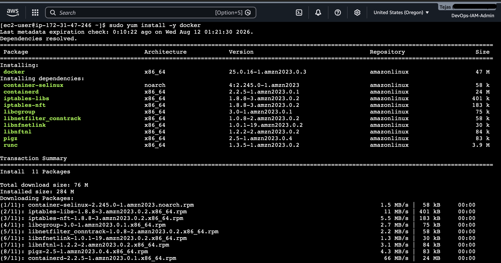](images/part2-03-install-docker.png)

---

## Step 5 — Start the Docker Service

Start the Docker daemon:

```bash
sudo service docker start
```

Docker must be running before images can be built or pushed.

[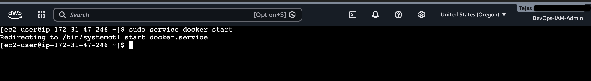](images/part2-04-start-docker.png)

---

## Step 6 — Give `ec2-user` Access to Docker

An initial Docker build attempt returned a permission error while trying to access the Docker socket:

```text
permission denied while trying to connect to the Docker daemon socket
```

Add `ec2-user` to the `docker` group:

```bash
sudo usermod -a -G docker ec2-user
```

[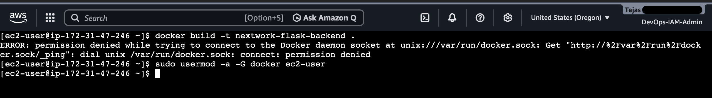](images/part2-05-add-ec2-user-docker-group.png)

After updating the group membership, reconnect to the EC2 session so the new permissions take effect.

Verify the membership:

```bash
groups ec2-user
```

The output should include:

```text
docker
```

[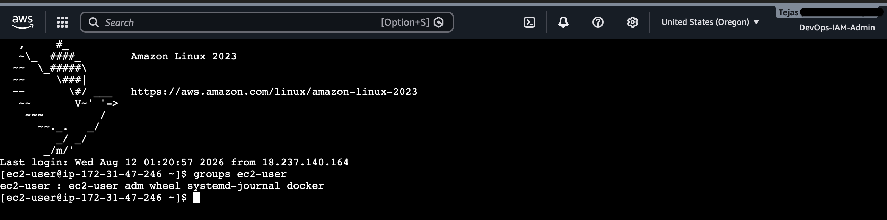](images/part2-06-verify-docker-group.png)

---

## Step 7 — Build the Flask Backend Docker Image

Make sure the terminal is inside the directory containing the `Dockerfile`:

```bash
cd ~/nextwork-flask-backend
```

Build the container image:

```bash
docker build -t nextwork-flask-backend .
```

The trailing `.` tells Docker to use the current directory as the build context.

During the build, Docker:

- Read the application `Dockerfile`.
- Pulled the Python base image.
- Copied the dependency file.
- Installed the Python dependencies.
- Copied the application code into the image.
- Created the local `nextwork-flask-backend` image.

The completed output showed that the image was successfully built and named:

```text
docker.io/library/nextwork-flask-backend
```

[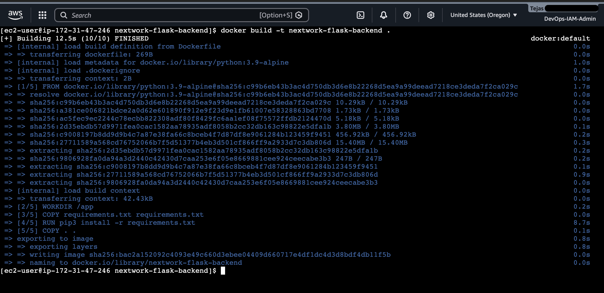](images/part2-07-docker-build-success.png)

---

## Step 8 — Create a Private Amazon ECR Repository

Amazon ECR provides a private registry where the Docker image can be stored and later pulled by services such as Amazon EKS.

Create the repository:

```bash
aws ecr create-repository \
  --repository-name nextwork-flask-backend \
  --image-scanning-configuration scanOnPush=true \
  --region us-west-2
```

The command created the repository and enabled image scanning whenever a new image is pushed.

[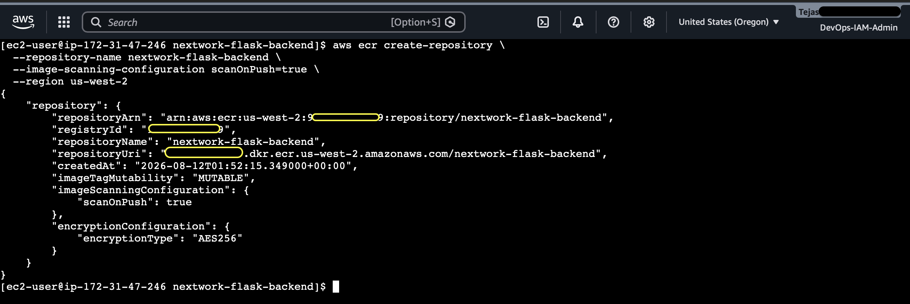](images/part2-08-create-ecr-repository.png)

Verify the repository in **Amazon ECR → Private registry → Repositories**.

[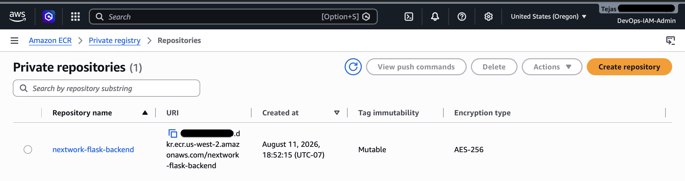](images/part2-09-ecr-repository-console.png)

---

## Step 9 — Open the ECR Push Commands

Select the `nextwork-flask-backend` repository in the ECR console and choose **View push commands**.

AWS provides the commands required to:

1. Authenticate Docker to the private ECR registry.
2. Build an image.
3. Tag the local image using the ECR repository URI.
4. Push the tagged image to ECR.

The image was already built in the previous step, so the additional build command shown by ECR did not need to be repeated.

[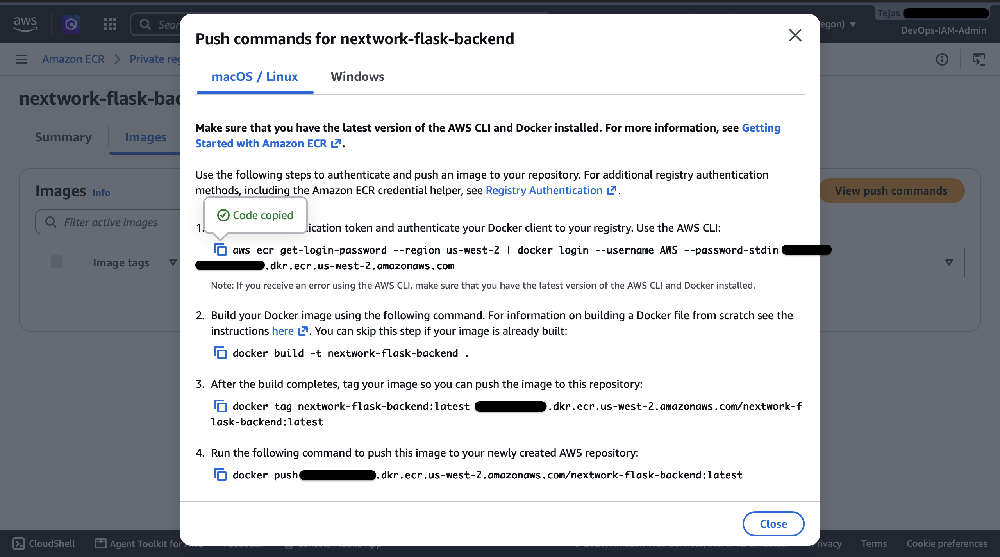](images/part2-10-ecr-push-commands.png)

---

## Step 10 — Authenticate Docker to Amazon ECR

Authenticate Docker using an ECR login password generated by the AWS CLI:

```bash
aws ecr get-login-password --region us-west-2 \
  | docker login \
      --username AWS \
      --password-stdin <AWS_ACCOUNT_ID>.dkr.ecr.us-west-2.amazonaws.com
```

A successful authentication returns:

```text
Login Succeeded
```

[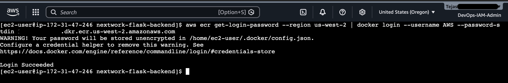](images/part2-11-ecr-docker-login.png)

> Replace `<AWS_ACCOUNT_ID>` with the AWS account ID shown in your own ECR repository URI, or copy the exact login command directly from **View push commands** in the ECR console.

---

## Step 11 — Tag the Local Docker Image

Tag the local image using the full ECR repository URI:

```bash
docker tag nextwork-flask-backend:latest \
  <AWS_ACCOUNT_ID>.dkr.ecr.us-west-2.amazonaws.com/nextwork-flask-backend:latest
```

The tag connects the local Docker image with the destination repository in ECR.

---

## Step 12 — Push the Container Image to ECR

Push the tagged image:

```bash
docker push \
  <AWS_ACCOUNT_ID>.dkr.ecr.us-west-2.amazonaws.com/nextwork-flask-backend:latest
```

Docker uploaded the image layers and returned the final image digest after the push completed successfully.

[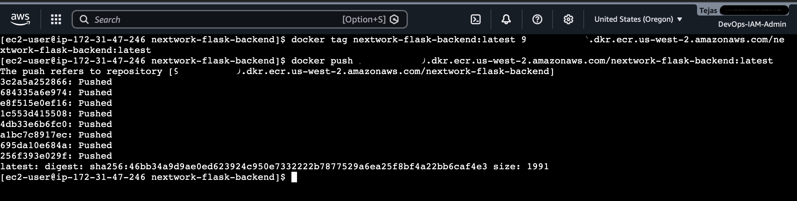](images/part2-12-tag-and-push-image.png)

---

## Step 13 — Verify the Image in Amazon ECR

Return to the `nextwork-flask-backend` repository in the ECR console and refresh the **Images** page.

The repository now contains a container image tagged:

```text
latest
```

This confirms that the backend image is stored in ECR and is ready to be referenced by a Kubernetes Deployment in the next stage of the project.

[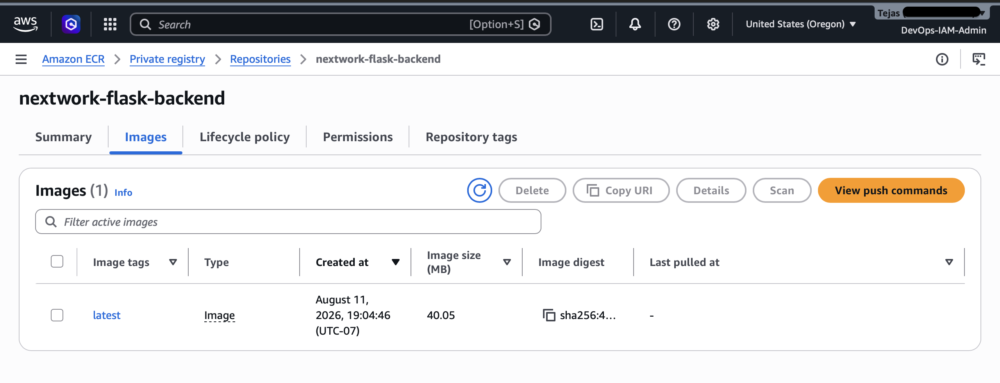](images/part2-13-ecr-image-created.png)

---

### Part 2 Result

At the end of this stage, the application flow is:

```text
GitHub source code
      │
      ▼
EC2 management instance
      │
      ▼
Docker image
      │
      ▼
Amazon ECR
      │
      ▼
Ready for Kubernetes deployment
```

---

# Part 3 — Create Kubernetes Manifests

Part 3 defines how Kubernetes should run and expose the Flask backend. The EKS cluster, EC2 management instance, and ECR image from the earlier stages are reused rather than recreated.

## Step 1 — Create a Directory for Kubernetes Manifests

Create a dedicated directory and move into it:

```bash
mkdir -p manifests
cd manifests
```

This directory stores the Deployment and Service YAML files used by Kubernetes.

> No screenshot was captured for this step.

---

## Step 2 — Install `kubectl`

`kubectl` is the Kubernetes command-line tool used to communicate with the EKS cluster.

For the Kubernetes `1.33` cluster used in this project, install a compatible `kubectl` binary. For example:

```bash
sudo curl -o /usr/local/bin/kubectl \
  https://s3.us-west-2.amazonaws.com/amazon-eks/1.33.13/2026-07-05/bin/linux/amd64/kubectl
```

The screenshot below captures the `kubectl` installation performed from the EC2 management instance.

[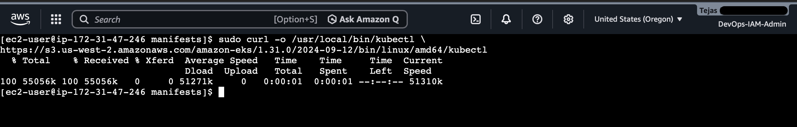](images/part3-4-01-install-kubectl.png)

---

## Step 3 — Make `kubectl` Executable and Verify It

Give the downloaded binary execute permission:

```bash
sudo chmod +x /usr/local/bin/kubectl
```

Verify the installation:

```bash
kubectl version
```

The project environment used a Kubernetes `1.33` EKS control plane, so the client was updated to a compatible `1.33` version as well.

[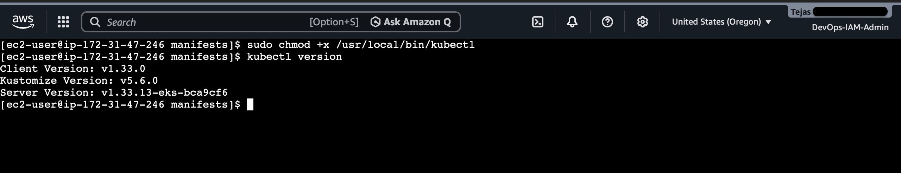](images/part3-4-02-kubectl-permissions-version.png)

---

## Step 4 — Create the Deployment Manifest

Create the Deployment manifest:

```bash
nano flask-deployment.yaml
```

Add the following configuration, replacing `<AWS_ACCOUNT_ID>` with the AWS account that owns the ECR repository:

```yaml
apiVersion: apps/v1
kind: Deployment
metadata:
  name: nextwork-flask-backend
  namespace: default
spec:
  replicas: 3
  selector:
    matchLabels:
      app: nextwork-flask-backend
  template:
    metadata:
      labels:
        app: nextwork-flask-backend
    spec:
      containers:
        - name: nextwork-flask-backend
          image: <AWS_ACCOUNT_ID>.dkr.ecr.us-west-2.amazonaws.com/nextwork-flask-backend:latest
          ports:
            - containerPort: 8080
```

This manifest tells Kubernetes to maintain **three backend pods** running the container image stored in Amazon ECR.

The Deployment selector and pod labels both use:

```text
app: nextwork-flask-backend
```

This matching label is also used by the Service to locate the application pods.

[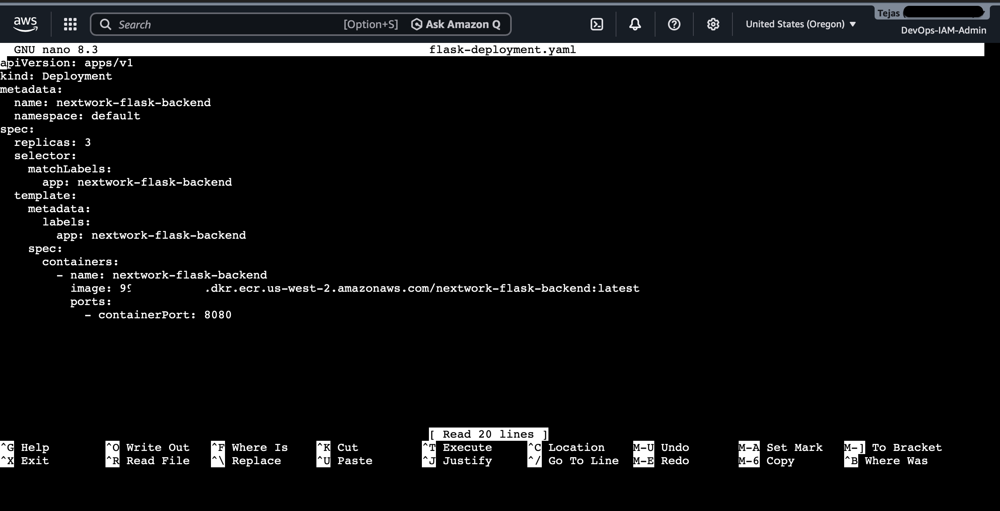](images/part3-4-03-flask-deployment-manifest.png)

---

## Step 5 — Create the Service Manifest

Create the Service manifest:

```bash
nano flask-service.yaml
```

Add:

```yaml
---
apiVersion: v1
kind: Service
metadata:
  name: nextwork-flask-backend
spec:
  selector:
    app: nextwork-flask-backend
  type: NodePort
  ports:
    - port: 8080
      targetPort: 8080
      protocol: TCP
```

The Service uses the same application label as the Deployment and forwards traffic to the backend containers on port `8080`.

[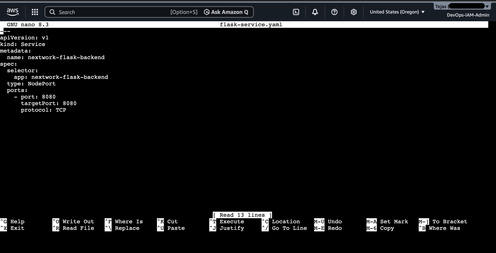](images/part3-4-04-flask-service-manifest.png)

At this point, **Part 3 is complete**: the Kubernetes manifests have been created and are ready to be deployed.

---

---

# Part 4 — Deploy the Backend to Amazon EKS

Part 4 reuses the manifests from Part 3 and focuses on connecting `kubectl` to EKS, applying the resources, and verifying the deployed backend.

## Step 1 — Connect `kubectl` to the EKS Cluster

Update the local kubeconfig so `kubectl` targets the correct EKS cluster:

```bash
aws eks update-kubeconfig \
  --name nextwork-eks-cluster \
  --region us-west-2
```

A successful command updates the cluster context in:

```text
/home/ec2-user/.kube/config
```

> No screenshot was captured for this command.

---

## Step 2 — Configure Kubernetes Access for the EC2 Management Role

The EC2 management instance uses an IAM role to call AWS and Kubernetes APIs. During this project, the role was mapped for cluster administration in the lab environment:

```bash
eksctl create iamidentitymapping \
  --cluster nextwork-eks-cluster \
  --arn arn:aws:iam::<AWS_ACCOUNT_ID>:role/eks-instance-role \
  --group system:masters \
  --username admin \
  --region us-west-2
```

[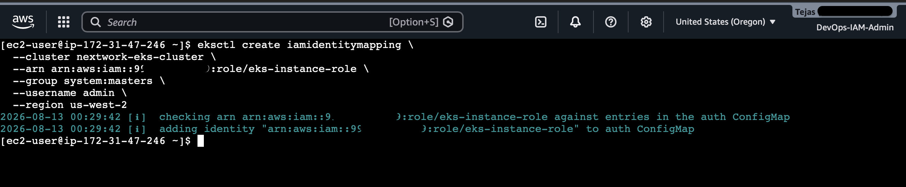](images/part3-4-05-configure-cluster-access.png)

> For clusters configured with EKS Access Entries, the equivalent IAM principal can be granted Kubernetes permissions through an EKS access entry and access policy instead of relying only on the legacy `aws-auth` mapping.

---

## Step 3 — Apply the Kubernetes Manifests

From the `manifests` directory, deploy both resources:

```bash
kubectl apply -f flask-deployment.yaml
kubectl apply -f flask-service.yaml
```

The successful output confirmed that both resources were created:

```text
deployment.apps/nextwork-flask-backend created
service/nextwork-flask-backend created
```

[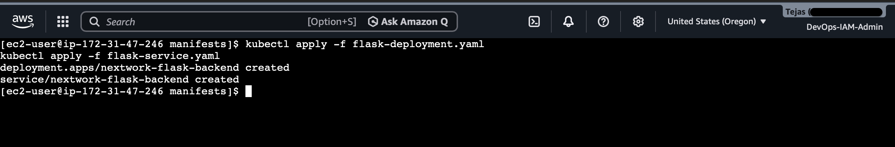](images/part3-4-06-apply-manifests.png)

---

## Step 4 — Verify the EKS Worker Nodes and Backend Pods

Check the cluster nodes:

```bash
kubectl get nodes
```

Then check the Flask backend pods:

```bash
kubectl get pods
```

During this project run, all three EKS worker nodes were `Ready`. At the moment the screenshot was captured, two Flask pods were `Running` while the third replica was still `Pending`.

[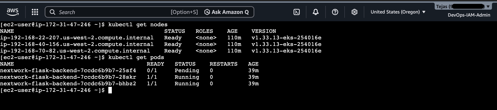](images/part3-4-07-verify-nodes-pods.png)

The three worker node names returned by `kubectl` were also recorded separately for comparison with the AWS console:

[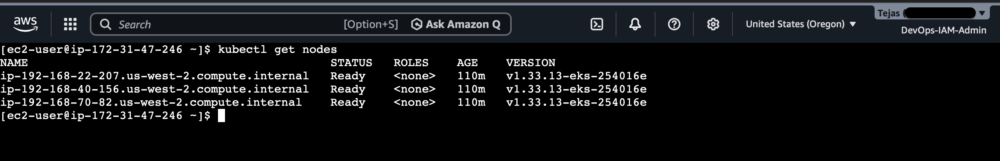](images/part3-4-08-terminal-node-verification.png)

---

## Step 5 — Verify the Worker Nodes in the Amazon EKS Console

Open:

```text
AWS Console → Amazon EKS → Clusters → nextwork-eks-cluster → Compute
```

The console displayed the same three worker nodes shown by `kubectl`, all with a `Ready` status.

[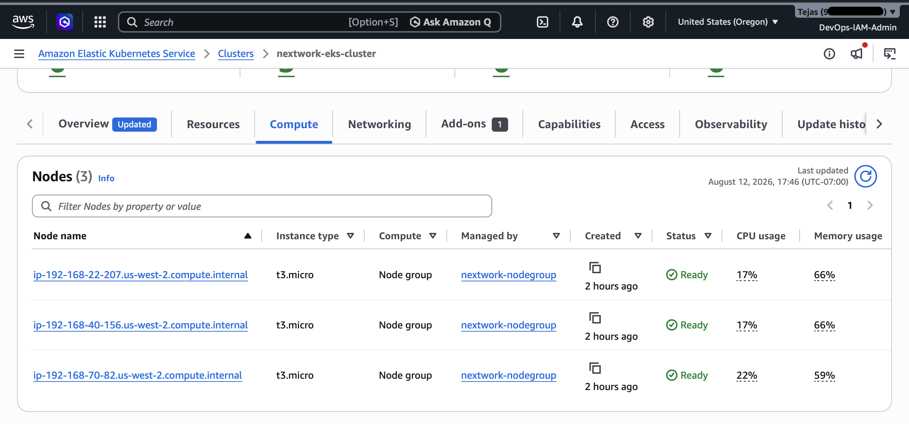](images/part3-4-09-eks-console-nodes.png)

This confirms that the Kubernetes CLI and the AWS console are both referencing the same managed EKS worker nodes.

---

## Step 6 — Inspect the Deployed Pod Events — Part 4 Final Verification

The final verification step was to inspect one of the running backend pods from the EKS console.

The pod events showed the full startup sequence:

```text
Scheduled
   ↓
Pulling image from Amazon ECR
   ↓
Pulled image successfully
   ↓
Created container
   ↓
Started container
```

The event log also confirmed that Kubernetes successfully pulled:

```text
nextwork-flask-backend:latest
```

from the private Amazon ECR repository.

[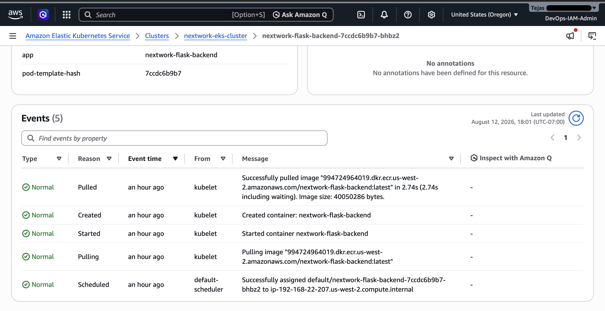](images/part3-4-10-pod-events.png)

This is the key additional outcome of **Part 4**: the manifests created in Part 3 were applied to the EKS cluster and the backend container was successfully scheduled, pulled from ECR, created, and started by Kubernetes.

---

---

# End-to-End Verification

Use the following commands from the EC2 management instance to verify the complete environment:

```bash
# Confirm AWS identity
aws sts get-caller-identity

# Confirm eksctl
eksctl version

# Confirm the EKS cluster
aws eks list-clusters --region us-west-2
eksctl get cluster --region us-west-2

# Confirm Kubernetes nodes and workloads
kubectl get nodes
kubectl get deployments
kubectl get pods
kubectl get services

# Inspect a specific pod when needed
kubectl describe pod <POD_NAME>
```

Expected high-level state:

```text
EKS Cluster: nextwork-eks-cluster        Active
Managed Node Group: nextwork-nodegroup   Active
Worker Nodes                             3 Ready
Backend Deployment                       Created
Backend Service                          Created
Container Image                          Stored in ECR
```

# Final Project Outcome

By the end of the complete project:

- **1 Amazon EKS cluster** was provisioned.
- **1 managed node group** was created.
- **3 EC2 Kubernetes worker nodes** joined the cluster.
- The Flask backend was containerized with **Docker**.
- The application image was stored in **Amazon ECR**.
- A Kubernetes **Deployment** defined three desired backend replicas.
- A **NodePort Service** exposed the backend on port `8080`.
- `kubectl` was configured to communicate with the EKS cluster.
- Kubernetes successfully pulled the private ECR image and started the backend containers.
- The environment was verified from both the CLI and the AWS Management Console.

## Project Series Completed

```text
Part 1 — Launch a Kubernetes Cluster             ✅
Part 2 — Containerize & Push Image to ECR        ✅
Part 3 — Create Kubernetes Manifests             ✅
Part 4 — Deploy Backend with Kubernetes          ✅
```

# Cleanup

If the application resources should be removed but the cluster should remain:

```bash
kubectl delete -f flask-service.yaml
kubectl delete -f flask-deployment.yaml
```

If the entire EKS lab is finished:

```bash
eksctl delete cluster \
  --name nextwork-eks-cluster \
  --region us-west-2
```

After deletion, verify that the cluster, worker-node EC2 instances, and related `eksctl` CloudFormation stacks have been removed. Stop or terminate the EC2 management instance and delete the ECR repository if they are no longer needed.

# References

- [NextWork — Launch a Kubernetes Cluster](https://nextwork.ai/projects/aws-compute-eks1?track=high)
- [NextWork — Set Up Kubernetes Deployment](https://nextwork.ai/projects/aws-compute-eks2)
- [NextWork — Create Kubernetes Manifests](https://nextwork.ai/projects/aws-compute-eks3)
- [NextWork — Deploy Backend with Kubernetes](https://nextwork.ai/projects/aws-compute-eks4)
- [AWS — Get started with Amazon EKS using eksctl](https://docs.aws.amazon.com/eks/latest/userguide/getting-started-eksctl.html)
- [AWS — Install kubectl for Amazon EKS](https://docs.aws.amazon.com/eks/latest/userguide/install-kubectl.html)
- [Amazon ECR — Pushing a Docker image](https://docs.aws.amazon.com/AmazonECR/latest/userguide/docker-push-ecr-image.html)
- [Kubernetes — Deployments](https://kubernetes.io/docs/concepts/workloads/controllers/deployment/)
- [Kubernetes — Services](https://kubernetes.io/docs/concepts/services-networking/service/)
